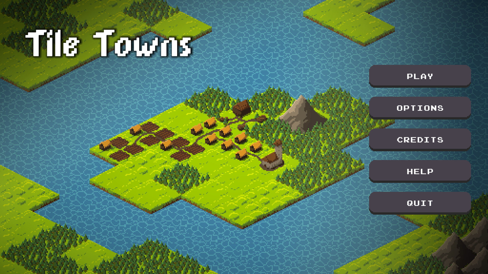

# Tile Towns

### Turn-based Strategic City-Building Puzzle Game

Strategically plan and evolve your burgeoning settlement turn by turn. Encounter unique challenges in each level, urging you to thoughtfully position various structures. Delve into the nuances of every building type, mastering their multifaceted upgrades and mechanics to fulfill your goals. Harness the vast potential of your metropolis and strike the ideal equilibrium between growth and strategy.

### Game Features:
* Varied levels each with distinct victory and defeat conditions.
* Unique maps demanding tailored strategies for success.
* Attractive immigration mechanics: draw settlers to your domain.
* Assign your populace to key structures, optimizing city performance.
* Unlock Steam Achievements!
* Comprehensive in-game settings for tailored gameplay.

### Built With:
* C#
* Unity Game Engine
* Aseprite
* Zenject

  

